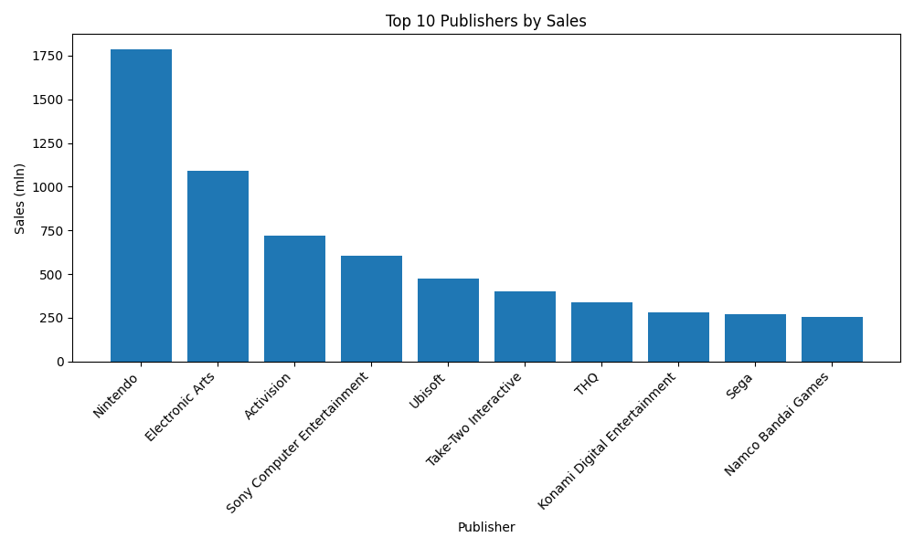
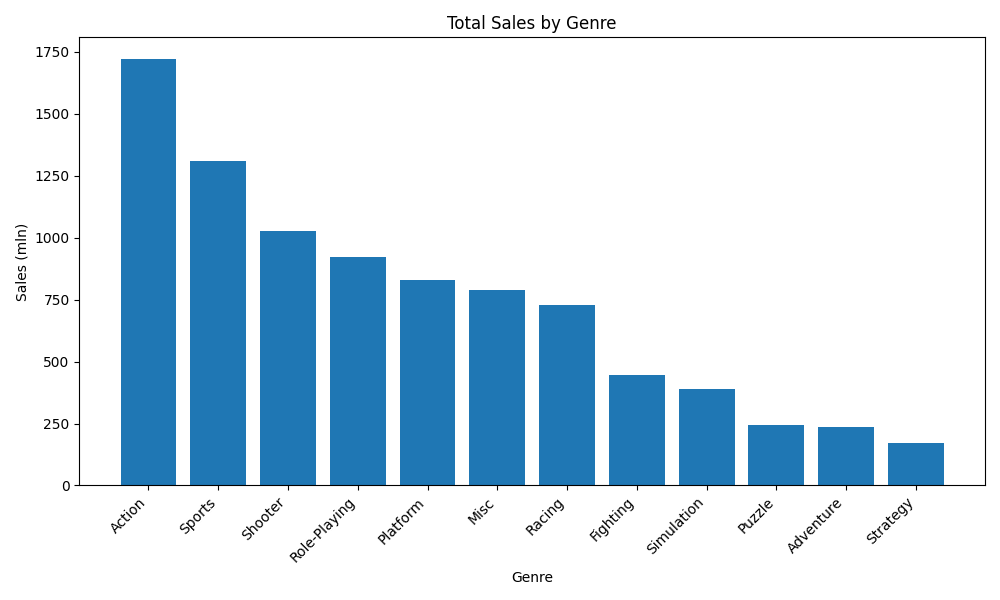
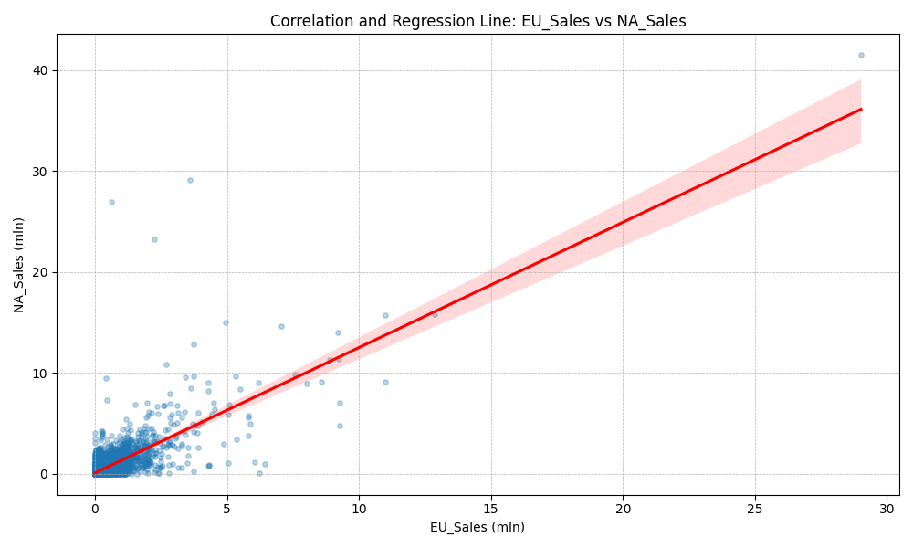

# Video Game Sales Analysis
This project provides an in-depth analysis of the Video Game Sales dataset from Kaggle. The main goal is to uncover trends and insights related to game sales across different genres, platforms, publishers, and regions.

The full analysis and narrative are presented in the analysis.ipynb Jupyter Notebook.

## Key Findings & Visualizations

### Top 10 Publishers by Global Sales
The analysis shows that the market is dominated by a few major publishers, with Nintendo and Electronic Arts leading the industry.


### Total Sales by Genre
Action and Sports are the highest-grossing genres, likely due to their broad appeal and annual releases of popular franchises.


### Sales Correlation: Europe vs. North America
There is a strong positive correlation between sales in Europe and North America, which suggests that player preferences in these two key markets are very similar.


### Technologies Used
- Python
- pandas
- Matplotlib
- Seaborn
- Jupyter Notebook

### Setup and Usage
To run this analysis locally, follow these steps:

1.  **Clone the repository:**
    ```bash
    git clone [https://github.com/ssowula/Video-Game-Sales-Analysis.git](https://github.com/ssowula/Video-Game-Sales-Analysis.git)
    cd Video-Game-Sales-Analysis
    ```

2.  **Install dependencies:**
    It is recommended to use a virtual environment.
    ```bash
    pip install -r requirements.txt
    ```

3.  **Run Jupyter Notebook:**
    ```bash
    jupyter notebook analysis.ipynb
    ```